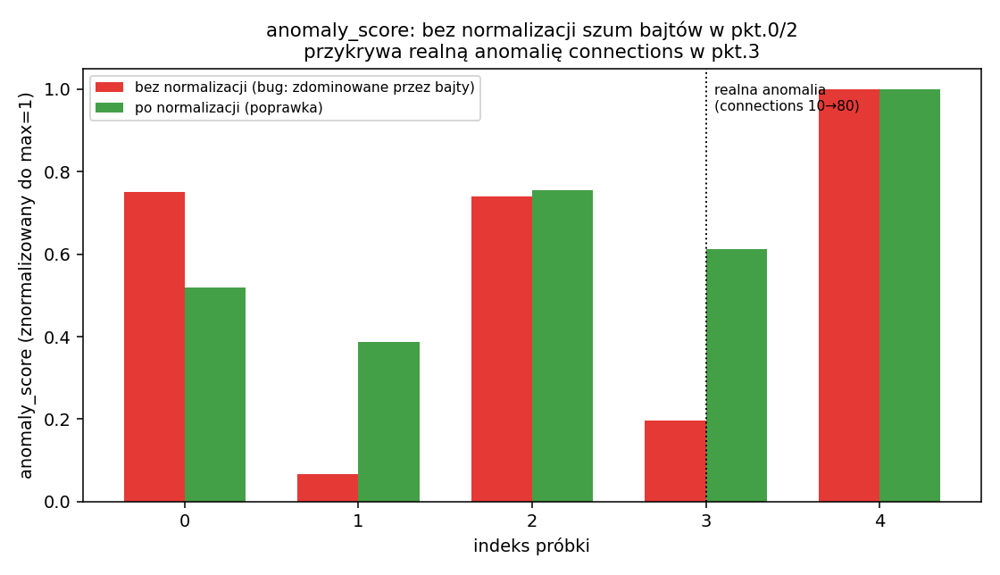
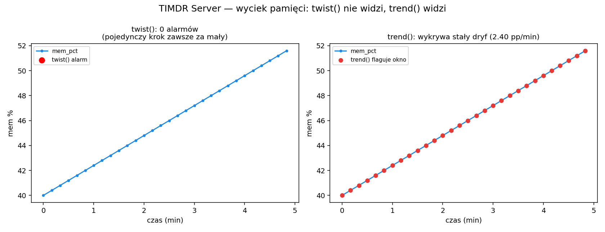

# TIMDR Security Module + TIMDR Server Module

Dwa moduły do wykrywania anomalii metodą TIMDR (gradient przepływu,
"twist" = nagła zmiana, TRM = redukcja szumu, anomaly score):

- **`timdr_security.py`** — ruch sieciowy: `[bytes_in, bytes_out, connections, t]`
  (ze zgłoszenia, przetestowany i naprawiony)
- **`timdr_server.py`** — metryki serwera produkcyjnego:
  `[cpu_pct, mem_pct, load_avg, t]` (nowy moduł, dodany na prośbę
  "dodaj moduł dla serwerów produkcyjnych")

## Status

`timdr_security.py`: 7/7 testów. `timdr_server.py`: 15/15 testów
(łącznie z testami dla `timdr_security.py`). Znalezione i naprawione w
`timdr_security.py`: 3 błędy, w tym jeden powodujący, że własny
przykład DDoS z opisu zgłoszenia nie był wykrywany.

## 🐛 Błędy znalezione w oryginalnym `timdr_security.py`

### 1. Samo-zatruwający się próg adaptacyjny w `twist_conns`

```python
twist_conns = np.where(np.abs(dconns) > np.mean(np.abs(dconns)) * 3)[0]
```

Próg liczony jest z `np.mean()` **całej próbki, włącznie z badanym
punktem**. Gdy w próbce jest realna anomalia, ona sama zawyża próg,
który ma ją wykryć.

Zweryfikowano na przykładzie DDoS z opisu zgłoszenia: `dconns` w
punkcie anomalii = 13.5-14.0, próg `mean*3` = **18.9** (zawyżony
właśnie przez tę anomalię) → `connection_twist` wychodził **pusty**,
mimo że to jest dosłownie przykład z README opisany jako "TIMDR-flow →
wykrywa skok". Naprawiono: robust leave-one-out z-score (mediana + MAD
liczone z próbki **bez** badanego punktu) — ten sam przykład daje
z-score ~16-17 dla punktów anomalii i <1 dla normalnych.

### 2. `dratio`/`dconns` liczone po indeksie próbki, nie po czasie

`np.gradient(ratio)` i `np.gradient(conns)` (bez `t`) dają identyczny
wynik niezależnie od rzeczywistego odstępu czasowego między próbkami.
Zweryfikowano: ta sama sekwencja wartości próbkowana co 1s i co 4s dała
**identyczny** wynik `twist`, mimo 4-krotnie różnej realnej dynamiki w
czasie. Naprawiono: `np.gradient(ratio, t)`, `np.gradient(conns, t)`.

### 3. `anomaly_score` bez normalizacji jednostek — zdominowany przez skalę bajtów



`np.linalg.norm(grad, axis=1)` liczony wprost na `[bytes_in, bytes_out,
connections]`. Bajty (rzędu dziesiątek tysięcy) numerycznie dominują
nad connections (rzędu dziesiątek). Zweryfikowano na realistycznym
przykładzie: zwykły szum bajtów w punkcie **bez żadnej anomalii** dawał
**wyższy** anomaly_score (782.8, 97.9% z bajtów) niż punkt z **realnym
8-krotnym wzrostem liczby połączeń** (204.2, tylko 20.9% z connections)
— dokładnie odwrotnie niż powinno być, i wprost zaprzecza własnemu
punktowi "5. Lateral movement → zmiany connections" z opisu zgłoszenia.
Naprawiono: każda cecha normalizowana (mediana/MAD) przed połączeniem w
normę.

## 🆕 TIMDR Server Module — dla serwerów produkcyjnych

Ten sam szkielet (`twist`, `trm_reduce`, `anomaly_score`) zastosowany
do `[cpu_pct, mem_pct, load_avg, t]`, plus dwie rzeczy specyficzne dla
monitoringu serwerów, których w wersji sieciowej brakuje:

### `trend()` — wykrywanie POWOLNEGO dryfu (np. wyciek pamięci)



`twist()` z definicji wykrywa tylko **nagłe** zmiany między kolejnymi
próbkami. Najczęstszy realny problem na serwerze produkcyjnym — wyciek
pamięci — rośnie po odrobinę na każdą próbkę (np. +0.4pp/próbkę).
Zweryfikowano: syntetyczny wyciek +0.4pp/próbkę przez 30 próbek (łącznie
+11.6pp w ~5 minut) — `twist()` **nie zgłasza ani jednego punktu**
(każdy krok jest za mały), `trend()` (regresja liniowa w oknie
kroczącym) poprawnie wykrywa stałe dodatnie nachylenie od pierwszego
okna. Test regresyjny:
`test_trend_wykrywa_powolny_wyciek_pamieci_ktorego_twist_pomija`.

### `counters_to_rates()` — bezpieczna konwersja liczników monotonicznych

Klasyczne źródła metryk serwerowych (node_exporter, WMI performance
counters, `/proc/net/dev`) eksponują **rosnące liczniki** (np. "bajty
wysłane od bootu"), nie gotowe wartości na sekundę. Wrzucenie takiego
licznika wprost do `timdr_flow()`/`twist()` daje niemal stałe,
bezużyteczne nachylenie. `counters_to_rates()` przelicza licznik na
wartość/s **i** obsługuje restart procesu (licznik spada do zera) —
bez tej obsługi restart wygląda jak gigantyczny fałszywy spadek.
Zweryfikowano: licznik 10 000 000 → 500 (restart) → 20 000 daje bez
poprawki `rate = -1 004 950/s` (nonsens), z poprawką `rate = 0/s`
w kroku resetu. Test: `test_counters_to_rates_obsluga_restartu`.

## 🎯 Zastosowania (i warunki, przy których mają sens)

**1. IDS/IPS — flagowanie do przeglądu, nie automatyczna blokada**
`twist()`/`anomaly_score()` jako pierwszy filtr dla analityka SOC.
*Warunki:* progi (`ratio_thresh`, `conns_z_thresh`, `z_thresh`) trzeba
dostroić do normalnego ruchu Twojej sieci/serwera — domyślne wartości
to punkt startowy, nie uniwersalna norma. To narzędzie przesiewające,
nie certyfikowany silnik detekcji o niskim odsetku fałszywych alarmów.

**2. Monitoring serwerów produkcyjnych (CPU/mem/load)**
`timdr_server.twist()` na nagłe skoki, `trend()` na powolną degradację.
*Warunki:* metryki z liczników monotonicznych MUSZĄ przejść przez
`counters_to_rates()` najpierw; `trend()` wymaga regularnego,
wystarczająco gęstego próbkowania (okno `window` próbek musi obejmować
realny przedział czasu, w którym dryf ma sens wykryć — za krótkie okno
= szum, za długie = spóźniona detekcja).

**3. Wykrywanie exfiltracji danych**
`ratio_twist` (nagła zmiana proporcji in/out) jako sygnał.
*Warunki:* normalny ruch (np. backup, sync w chmurze) też generuje
skoki `bytes_out` — bez białej listy znanych, legalnych wzorców ruchu
to źródło fałszywych alarmów, nie gotowy alarm.

**4. Malware beaconing (regularne, rytmiczne połączenia)**
README zgłoszenia sugeruje to jako zastosowanie TRM+TIMDR-flow, ale
**żaden z dostarczonych detektorów faktycznie tego nie wykrywa** — TRM
tylko wygładza szum, nie wykrywa okresowości. Do wykrywania rytmiczności
potrzebna jest analiza autokorelacyjna (dokładnie taka, jaką dodaliśmy
wcześniej w `RHYTHM ANALYZER v1.py` z MAGE-IN-IMAGE-DECODER) — to
osobna funkcja, nie ma jej jeszcze w tym module. Zaznaczone jako
świadomie NIE zaimplementowane, żeby nie sugerować możliwości, której
kod nie ma.

**5. Lateral movement (zmiany connections)**
Po poprawce #3 (normalizacja `anomaly_score`) i #1 (robust threshold w
`twist_conns`) to zastosowanie faktycznie działa — wcześniej oba
mechanizmy miały błędy uniemożliwiające wykrycie dokładnie tego
scenariusza.

### Ograniczenia wspólne

- Metoda nie jest przyczynowa (`np.gradient` w punktach wewnętrznych
  używa różnicy centralnej) — detekcja w punkcie *i* korzysta też z
  *i+1*. Do strumienia na żywo nadaje się z jednopróbkowym opóźnieniem.
- Progi domyślne (`ratio_thresh=0.4`, `z_thresh=3.5`,
  `slope_thresh_per_min=1.0`) to punkty startowe do dostrojenia, nie
  zwalidowane wartości branżowe.
- Brak wbudowanej detekcji okresowości/rytmiczności (patrz punkt 4
  wyżej) — do beaconingu potrzeba osobnego modułu autokorelacyjnego.

## Przykład użycia

```python
from timdr_security import TIMDRSecurity
from timdr_server import TIMDRServer

sec = TIMDRSecurity()
flow = [[1000,800,12,0],[1200,900,13,1],[1500,1100,14,2],[5000,2000,40,3],[5200,2100,42,4]]
print(sec.twist(flow))          # teraz wykrywa connections (poprawka #1)
print(sec.anomaly_score(flow))  # teraz znormalizowany (poprawka #3)

srv = TIMDRServer()
metrics = [[20,40,0.5,0],[22,41,0.6,10],[95,42,4.0,20],[30,43,0.7,30],[25,44,0.6,40]]
print(srv.twist(metrics))
print(srv.trend(metrics, column=1))  # dryf mem_pct
```

Uruchomienie: `python demo.py` / testy: `pytest -q`.
